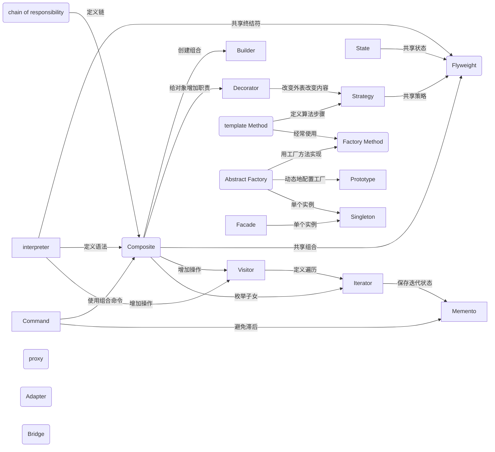

# 引言
## 1.5 组织编目
|范围|创建型|结构型|行为型|
|--|--|--|--|
|类|Factory Method(3.3)|Adapter(4.1)|Interpreter(5.3)  Template Method(5.10)|
|对象| Abstract Factory(3.1)|Adapter(4.1)|Chain of responsibility(5.1)|
||Builder(3.2)|Bridge(4.2)|Command(5.2)|
||Prototype(3.4)|Composite(4.3)|Iterator(5.4)|
||Singleton(3.5)|Decorator(4.4)|Mediator(5.5)|
|||Facade(4.5)|Memento(5.6)|
|||flyweight(4.6)|Observer(5.7)|
|||Proxy(4.7)|State(5.8)|
||||Strategy(5.9)|
||||Visitor(5.10)|

- 目的准则
    
    模式依据其目的可分为创建型、结构型或行为型。
    创建型模式鱼对象的创建有关；结构型模式处理类或对象的组合；行为型模式对类或对象怎样交互和怎样分配职责进行描述。

- 范围准则
    
    指定模式主要是用于类还是用于对象。
    类模式处理类和子类之间的关系，这些关系通过继承建立，是静态的，在编译时刻便确定下来了。
    对象模式处理对象间的关系，这些关系在运行时刻是可以变化的，更具动态性。
    从某种意义上来说，几乎所有模式都使用继承机制，所以“类模式”只值那些集中于处理类间关系的模式，而大部分模式都属于对象模式的范畴

创建类模式将对象的部分创建工作延迟到子类，而创建型对象模式则将它延迟到另一个对象中。
结构型类模式使用继承机制来组合类，而结构型对象模式则描述了对象的组装方式
行为型类模式使用继承描述算法和控制流，而行为型对象模式则描述一组对象怎样协作完成单个对象所无法完成的任务

