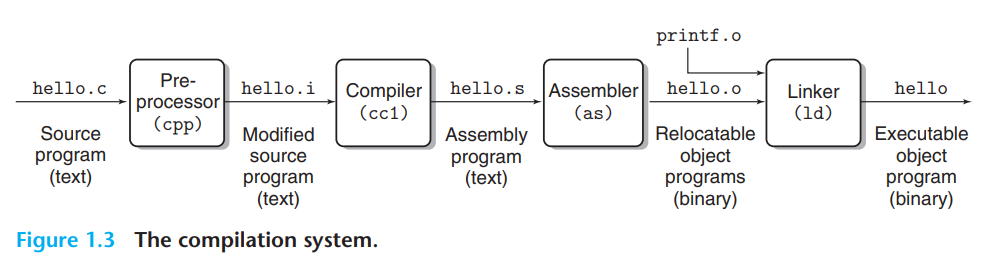

# a tour of computer systems
1. you are going to learn practical skills such as how to avoid strange numerical errors caused by teh way that computers represent numbers.
2. you will learn how to optimize your C code by ysing clever tricks that exploit the designs of modern processors and memory systems.
3. you will learn how the compiler implements procedure calls and how to use this knowledge to avoid the security holes from buffer overflow vulnerabilities that plague network and Internet software.
4. you will learn how to recognize and avoid the nasty errors during linking that confound the average programmer.
5. you will learn how to write your own unix shell, your own dynamic storage allocation package, and even your own Web server.
6. you will learn the promises and pitfalls of concurrency, a topic of increasing importance as multiple processor cores are integrated onto single chips.
## 1.1 information is bits + context
## 1.2 Programs are translated by other programs into different forms
In oder to run `hello.c` on the system, the individual C statements must be translated by other programs into a sequence of low-level machine-language instructions.
These instructions are then packaged in a form called an executable object program and stored as a binary disk file.
Object programs are also referred to as executable object files.

```bash
gcc -o hello hello.c
```

four phases: preprocessor, compiler, assembler, and linker
- Preprocessing phase.
the preprocessor(cpp) modifies the original C program according to directives that begin with the "#" character. 
For example, the `#include <stdio.h>` command in line 1 of `hello.c` tells the preprocessor to read the contents of the system header file `stdio.h` and insert it directly into the program text. 
The result is another C program, typically with the .i suffix.
- compilation phase.
The compiler(cc1) translates teh text file `hello.i` into the text file `hello.s`, which contains an assemble-language program.
this program includes the following definition of function `main`:
```
main:
    subq $8, %rsp
    movl $.LCO, %edi
    call puts
    movl $0, %eax
    addq $8, %rsp
    ret
```
Assembly language is useful because it provides a common output language for different compilers for different high-level languages.
- assemble phase
Next, the assembler translates `hello.s` into machine-language instructions, packages them in a form known as a `relocatable object program`, and stores the result in the object file `hello.o`. 
this file is a binary file containing 17 bytes to encode the instructions form function `main`. 
- linking phase
notice that our `hello` program calls the `printf` function, which is part of the standard C library provided by every C compiler.
The printf function resides in a separate precompiled object file called `printf.o`, which must somehow be merged with our `hello.o` program.
The linker(ld) handles this merging.
The result is the `hello` file, which is an executable object file that is ready to be loaded into memory and executed by the system.

## 1.3 it pays to understand how compilation system work

## 1.4 Processors Read and Interpret Instructions Stored in Memory
The register file is a small storage device that consists of a collection of word-size registers, 
each with its own unique name.
The ALU computes new data and address values.
- load: copy a byte or a word from main memory into a register, overwriting the previous contents of the register
- Store: copy a byte of a word from a register to a location in main memory, overwriting the previous contents of that location
- Operate: copy the contents of tow registers to the ALU, perform an arithmetic operation on the two words, and store the result in a register, overwriting the previous contents of that register.
- Jump: extract a word from the instruction itself and copy that word into the program counter, overwriting the previous value of the PC
  
## 1.5 Caches Matters
## 1.6 Storage Devices Form a Hierarchy
## 1.7 The operating system manages the Hardware
we can think of the operating system as a layer of software interposed between the application program and the hardware.
All attempts by an application program to manipulate the hardware must go through the operating system.

The operating system has two primary purpose:
    1. to protect the hardware from misuse by runaway applications
    2. to provide applications with simple und uniform mechanisms for manipulating complicated and often wildly different low-level hardware devices.

### 1.7.1 processes
when a program such as hello runs on a modern system, the operating system provides the illusion that the program is only one running on the system.
The program appears to have exclusive use of both the processor, main memory, and I/O devices.
The processor appears to execute the instructions in the program, one after other, without interruption.
By concurrently, we mean that the instructions of one process are interleaved with the instructions of another process.

The transition from one process to another is managed by the operating system kernel.
The kernel is the portion of the operating system code that is always resident in memory.
When an application program requires some action by the operating system, such as to read or write a file, 
it executes a special system call instruction,
transferring control to the kernel.
The kernel then performs the requested operation and returns back to the application program.
Note that the kernel is not separate process. Instead, it is a collection of code and data structures that the system uses to manage all the progresses.

### 1.7,2
### 1.7.3 Virtual memory
Virtual memory is an abstraction that provides each process with the illysion that it has exclusive use of the main memory.
Each process has the same uniform view of memory, which is known as its virtual address space.

In Linux, the topmost region of the address space is reserved for code data in the operating system that is common to all processes.

The lower region of the address space holds the code and data defined by the user's process.
The virtual address space seen by each process consists of a number of well-defined areas, each with a specific purpose.
- Program code and data. Code begins at the same fixed address for all processes, followed by data locations that correspond to global C variables. 
  The code and data areas are initialized directly from the contents of an executable object file.
- heap: The code and data areas are followed immediately by the run-time heap. The heap expands and contracts dynamically at run time as a result of calls to C standard library routines such as malloc and free.
- shared libraries. Near the middle of the address space is an area that holds the code and data form shared libraries such as the C standard library and the math library. 
- stack. at the top of the user's virtual address space is the user stack that the compiler uses to implement function calls.Like the heap, the user stack expands and contracts dynamically during the execution of the program.
  In particular, each time we call a function, the stack grows. each time we return from a function, it contracts.
- kernel virtual memory. The top region of the address space is reserved for the kernel.
  Application programs are not allowed to read or write the contents of this area or to directly call functions defined in the kernel code. Instead, they must invoke the kernel to perform these operations.

### 1.7.4 files
every I/O device, including disks, keyboards,displays and even networks,
is modeled as a file.
All input and output in the system is performed by reading and writing files, using a small set of system calls known as Unix I/O.
It provieds applications with a uniform view of all the varied I/O devices.

## 1.8 Systems communicate with other systems using networks
When the system copies a sequence of bytes from main memory to the network adapter,
the data flow across the network to another machine, 
instead of, say, to a local disk drive.

suppose we use a talnet client running on our local machine to connect to a talnet server on a remote machine.
After we log in to the remote machine and run a shell,
the remote shell is waiting to receive an input command.

## 1.9 inportant themes
### 1.9.1 Amdahl's law
when we speed up one part of a system, the effect on the overall system performance depends on both how significant this part was and how much it sped up.
Consider a system in which executing some application requires time T_old.
Suppose some part of the system requires a fraction alpha of this time, and that we improve its performance by a factor of k.
This is the major insight of Amdahl's law -- to significantly speed up the entire system, we must improve the speed of a very large fraction of the overall system.
### 1.9,2 Concurrency and Parallelism
Concurrency to refer to the general concept of a system with multiple, simultaneous activities,
and parallelism to refer to the use of concurrency to make a system run faster.

#### Thread-level concurrency
  building on the process abstraction, we are able to devise systems where multiple programs execute at the same time, leading to concurrency.
  With threads, we can even have multiple control flows executing within a single process.
  It involves having multiple copies of some of the CPU hardware, such as program counters and register files, while having only single copies of other parts of the hardware,
  such as the units that perform floating-point arithmetic
.

The use of multiprocessing can improve system performance in two ways.
- it reduces the need to simulate concurrency when performing multiple tasks.
  As mentioned, even a personal computer being used by a single person is expected to perform many activities concurrently
- it can run a single application program faster, but only if that program is expressed in terms of multiple threads that can effectively execute in parallel.
  

#### Instruction-level Parallelism
More recent processors can sustain execution rates of 2-4 instructions per clock cycle.
Any given instruction requires much longer from start to finish, perhaps 20 cycles or more,
but the processor uses a number of clever tricks to process as many as 100 instructions at a time.
Pipelining:
the actions required to execute an instruction are partitioned into different steps and the processor hardware is organized as a series of stages,
each performing one of these steps.
The stages can operate in parallel, working on different parts of different instructions.
we will see that a fairly simple hardware design can sustain an execution rate close to 1 instruction per clock cycle.

#### single-instruction, multiple-data (SIMD) parallelism (lowest level)
many modern processors have special hardware that allows a single instruction to cause multiple operations to be performed in parallel.

### 1.9.3 The importance of Abstractions in Computer systems
One aspect of good programming practice is to formulate a simple application program interface for a set of functions that alow programmers to use the code without having to delve into its inner workings.
On the processor side, the instruction set architecture provides an abstraction of the actual processor hardware.
with this abstraction, a machine-code program behaves as if it were executed on a processor that performs just one instruction at a time.
The underlying hardwware is far more elaborate, executing multiple instructions in parallel, but always in a way that is consistent with the simple, sequential model.
By keeping the same execution model, different processor implementations can execute the same machine code while offering a range of cose and performance.

## Part 1: Program Structure and Execution
## Chapter 2: Representing and Manipulating information
## 2.1 Information Storage
Modern computers store and process information represented as two-valued signals.
these lowly binary digits, or bits, form the basic of the digital revolution.